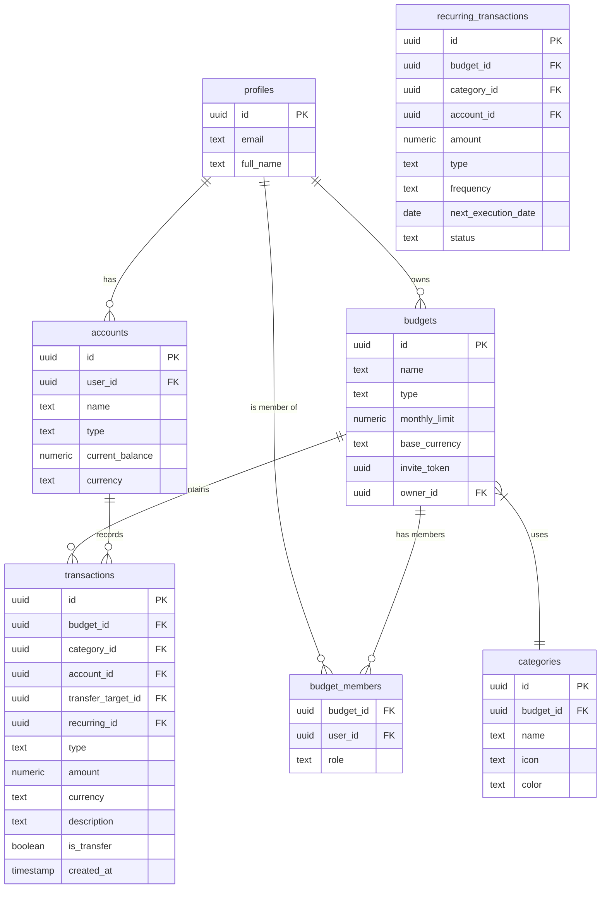

# Documento de Requerimiento Técnico: FinancePro

## 1. Objetivo del Sistema
Reemplazar el uso de Google Forms por una **Progressive Web App (PWA)** que permita el registro de movimientos financieros, la creación de presupuestos compartidos y la gestión de ahorros/gastos mediante invitaciones dinámicas.

---

## 2. Stack Tecnológico (Free Tier Focus)

> [!IMPORTANT]
> El stack está seleccionado para mantenerse dentro de los niveles gratuitos de cada servicio sin sacrificar escalabilidad.

- **Frontend**: React 18+ (Vite) + Tailwind CSS + Lucide React (iconos).
- **Backend & DB**: Supabase (PostgreSQL + Auth + RLS).
- **Auth**: Google OAuth 2.0.
- **Hosting**: Vercel (Frontend) + Supabase (Edge Functions opcionales).
- **Comunicación**: WhatsApp API (links wa.me).

---

## 3. Arquitectura de Datos (ERD)



### Detalle de Tablas

#### Tabla: `profiles`
| Campo | Tipo | Notas |
| :--- | :--- | :--- |
| `id` | `uuid` | Primary Key (Vinculado a `auth.users`) |
| `email` | `text` | Unique |
| `full_name` | `text` | Obtenido de Google |

#### Tabla: `accounts` [NUEVA]
| Campo | Tipo | Notas |
| :--- | :--- | :--- |
| `id` | `uuid` | Primary Key |
| `user_id` | `uuid` | FK a `profiles.id` |
| `name` | `text` | Ej: 'Santander', 'Efectivo', 'Lemon' |
| `type` | `text` | 'bank', 'cash', 'crypto', 'wallet' |
| `current_balance` | `numeric` | Saldo actual calculado |
| `currency` | `text` | Moneda de la cuenta |

#### Tabla: `budgets` (Presupuestos)
| Campo | Tipo | Notas |
| :--- | :--- | :--- |
| `id` | `uuid` | Primary Key |
| `name` | `text` | Nombre del presupuesto |
| `type` | `text` | 'gasto' (Personal/Compartido) o 'ahorro' |
| `monthly_limit` | `numeric` | Límite de gasto mensual (opcional) |
| `base_currency` | `text` | Moneda visual (ej: ARS, USD) |
| `invite_token` | `uuid` | Default: `gen_random_uuid()` |
| `owner_id` | `uuid` | FK a `profiles.id` |

#### Tabla: `categories`
| Campo | Tipo | Notas |
| :--- | :--- | :--- |
| `id` | `uuid` | Primary Key |
| `budget_id` | `uuid` | FK a `budgets.id` |
| `name` | `text` | Ej: 'Comida', 'Alquiler' |
| `icon` | `text` | Nombre del icono (Lucide) |
| `color` | `text` | Código Hex o nombre de color |

##### Categorías por Defecto (Seed Data)
Al crear un nuevo presupuesto, se inicializarán automáticamente las siguientes categorías:
- **Vivienda** (Icon: `Home`, Color: `Blue`)
- **Alimentación** (Icon: `Utensils`, Color: `Orange`)
- **Transporte** (Icon: `Car`, Color: `Gray`)
- **Salud** (Icon: `HeartPulse`, Color: `Red`)
- **Ocio** (Icon: `Ticket`, Color: `Purple`)
- **Suscripciones** (Icon: `Zap`, Color: `Yellow`)
- **Otros** (Icon: `MoreHorizontal`, Color: `Slate`)

#### Tabla: `budget_members`
| Campo | Tipo | Notas |
| :--- | :--- | :--- |
| `budget_id` | `uuid` | FK a `budgets.id` |
| `user_id` | `uuid` | FK a `profiles.id` |
| `role` | `text` | 'owner' o 'editor' |

#### Tabla: `transactions`
| Campo | Tipo | Notas |
| :--- | :--- | :--- |
| `id` | `uuid` | Primary Key |
| `budget_id` | `uuid` | FK a `budgets.id` (null si es transferencia interna) |
| `category_id` | `uuid` | FK a `categories.id` |
| `account_id` | `uuid` | FK a `accounts.id` (Cuenta de origen) |
| `transfer_target_id` | `uuid` | FK a `accounts.id` (Solo para transferencias) |
| `recurring_id` | `uuid` | FK a `recurring_transactions.id` (Opcional) |
| `type` | `text` | 'ingreso', 'egreso' |
| `amount` | `numeric` | Monto del movimiento |
| `is_transfer` | `boolean` | Indica si es movimiento entre cuentas propias |
| `description` | `text` | Opcional |
| `created_at` | `timestamp` | Default: `now()` |

#### Tabla: `recurring_transactions` [NUEVA]
| Campo | Tipo | Notas |
| :--- | :--- | :--- |
| `id` | `uuid` | Primary Key |
| `budget_id` | `uuid` | FK a `budgets.id` |
| `category_id` | `uuid` | FK a `categories.id` |
| `account_id` | `uuid` | FK a `accounts.id` |
| `amount` | `numeric` | Monto fijado |
| `type` | `text` | 'ingreso' o 'egreso' |
| `frequency` | `text` | 'daily', 'weekly', 'monthly', 'yearly' |
| `next_execution_date` | `date` | Próxima fecha de generación automática |
| `status` | `text` | 'active' o 'paused' |


---

## 4. Requerimientos Funcionales

- **RF1: Autenticación**: El sistema solo permitirá acceso a usuarios autenticados mediante Google. Al primer inicio de sesión, se debe crear automáticamente un perfil en la tabla `profiles`.
- **RF2: Gestión de Movimientos**: Formulario simplificado con validación de tipos de datos (Zod). Campo de fecha autocompletado con la fecha actual, pero editable.
- **RF3: Colaboración vía WhatsApp**: El creador de un presupuesto puede generar un link: `https://app.url/join?token={invite_token}`. Al acceder al link, se le añade automáticamente como 'editor' al presupuesto.
- **RF4: Creación de Presupuestos**: Los usuarios pueden crear presupuestos personales o compartidos.
- **RF5: Tracking de Límites**: El sistema notificará visualmente cuando un presupuesto de tipo "gasto" alcance o supere su `monthly_limit`.
- **RF6: Soporte Multi-moneda**: Soporte para visualizar balances en ARS o USD según la configuración del presupuesto o cuenta.
- **RF7: Gestión de Cuentas**: Permitir al usuario dar de alta múltiples cuentas (Banco, Billetera Digital, Efectivo) con un balance inicial.
- **RF8: Transferencias Internas**: Los movimientos entre cuentas del mismo usuario no deben impactar como gastos/ingresos en los presupuestos, sino como cambios de balance en cuentas.
- **RF9: Metas de Ahorro [EXTRA]**: Capacidad de apartar dinero de cuentas hacia un "presupuesto de ahorro" que actúa como meta.
- **RF10: Personalización de Categorías**: El sistema crea categorías por defecto para cada presupuesto, pero permite al usuario crear nuevas, editar sus iconos/colores o eliminarlas.
- **RF11: Movimientos Recurrentes**: Lógica para programar gastos o ingresos fijos (alquiler, saldos, servicios). El sistema genera automáticamente la transacción en la fecha indicada.
- **RF12: Exportación a CSV**: Permitir al usuario descargar su historial de movimientos por presupuesto para análisis externo.


---

## 5. Diseño de Interfaz (UI/UX)

### Vista Home (Advanced Dashboard)
Muestra el estado financiero global del usuario.
- **Patrimonio Total**: Suma de todas las cuentas.
- **Balances Temporales**: Gráfico de balance diario (tendencia del mes) y balance mensual (vs mes anterior).
- **Mis Cuentas**: Carrusel horizontal con las tarjetas de bancos/billeteras y sus saldos.
- **Resumen de Presupuestos**: Acceso rápido a presupuestos personales y compartidos con barras de progreso.

### Vista Gestión de Cuentas [NUEVA]
- Listado de cuentas con su saldo actual detallado.
- Formulario para agregar cuenta: Nombre, Tipo de Cuenta (Billetera, Banco, etc), Saldo Inicial y Moneda.

### Vista Creación de Presupuesto
Permite inicializar un nuevo grupo de gastos o una meta de ahorro.
- **Campos**: Nombre, Tipo (Personal/Compartido), Moneda, Límite (opcional).

### Vista Detalle de Presupuesto
- Historial de transacciones y gráfico de gastos por categoría (donut chart).
- Switch para filtrar entre "Mis movimientos" y "Movimientos compartidos" (si aplica).
- Acceso a **Configuración del Presupuesto** para gestionar categorías y miembros.
- **Botón Exportar**: Descarga el historial visible en formato CSV.

### Vista Gestión de Categorías
- Listado de categorías del presupuesto seleccionado.
- Opción para editar nombre, elegir un nuevo icono de una galería predefinida y seleccionar un color.

### Vista Programación / Recurrentes [NUEVA]
- Listado de todos los movimientos automáticos configurados.
- Formulario para programar: Monto, Categoría, Frecuencia y Fecha de inicio.

- **Campos**: Monto, Tipo (Gasto/Ingreso/Transferencia), Cuenta Origen, Cuenta Destino (si es Transferencia), Categoría, Fecha y Descripción.


## 6. Seguridad (Supabase RLS)

```sql
-- Ejemplo de política para la tabla transactions
CREATE POLICY "Users can view transactions of their budgets"
ON transactions FOR SELECT
USING (
  budget_id IN (
    SELECT budget_id FROM budget_members WHERE user_id = auth.uid()
  )
);
```

---

## 7. Plan de Despliegue
1. **Fase 1**: Configurar Proyecto en Supabase y habilitar Google Provider.
2. **Fase 2**: Ejecutar Scripts SQL (Tablas y RLS).
3. **Fase 3**: Desarrollar Frontend base en React + Vite.
4. **Fase 4**: Configurar CI/CD en Vercel.
